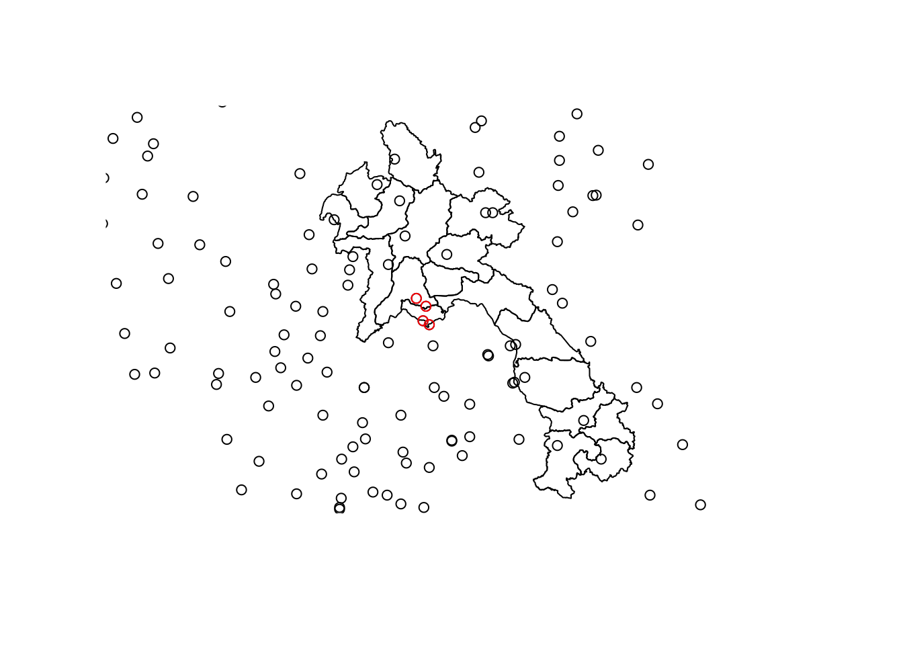
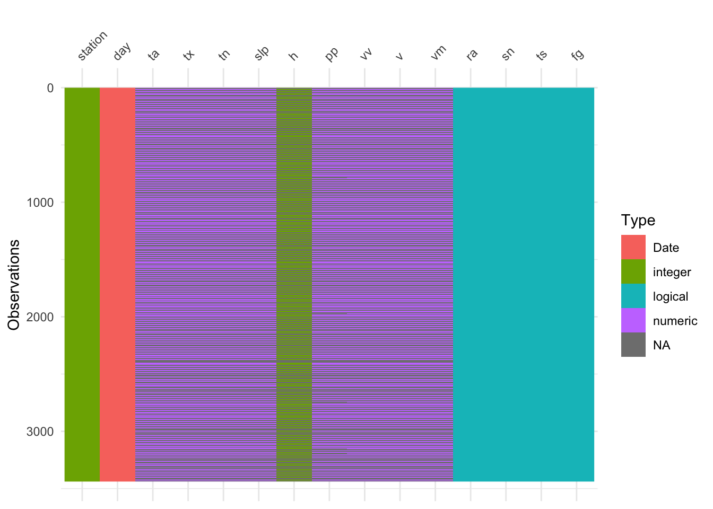
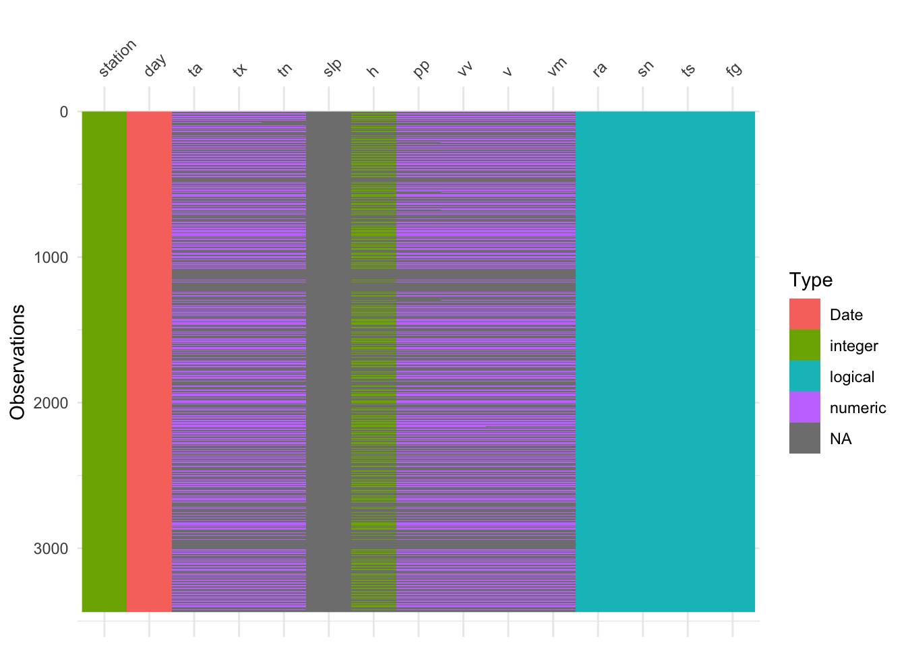
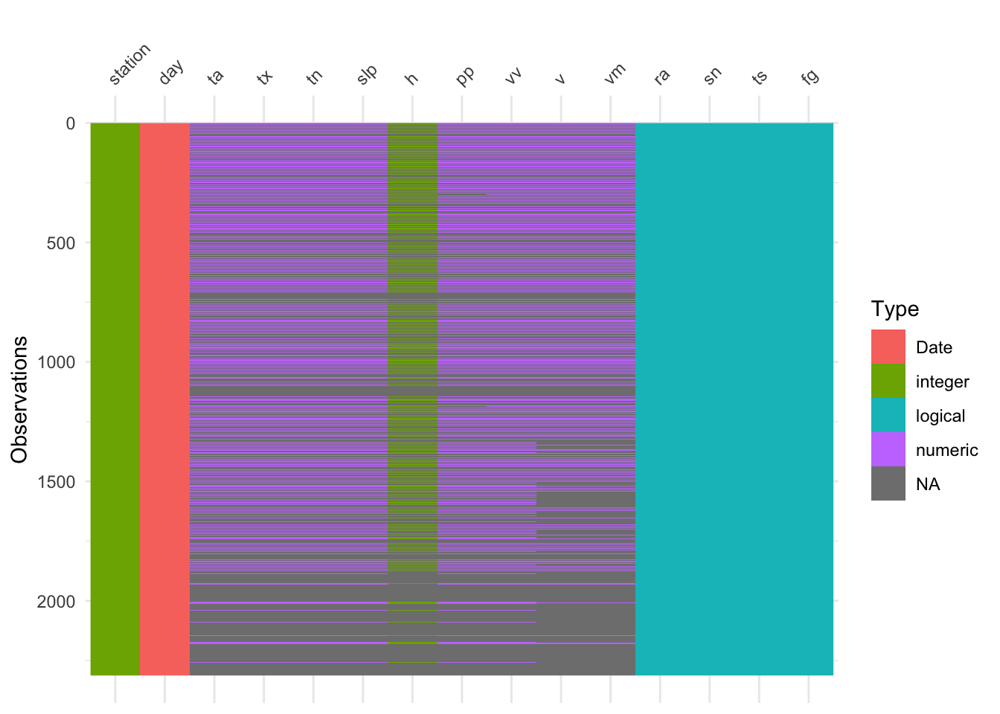

<!-- README.md is generated from README.Rmd. Please edit that file -->

# Meteorological data

<!-- badges: start -->

<!-- badges: end -->

Daily meteorological data were downloaded from
[TuTiempo.net](https://en.tutiempo.net) for the following 4 climatic
stations:

    #>    country  location station longitude latitude elevation
    #> 1     Laos  Phonhong  489410    102.40    18.46       179
    #> 2     Laos  Thangone  489440    102.63    18.28       185
    #> 3     Laos Vientiane  489400    102.56    17.95       171
    #> 4 Thailand Nong Khai  483520    102.71    17.86       174

Which, on the map, are located here in red, from left to right and from
top to
bottom:



After cleaning (see [cleaning
pipeline](https://ecomore2.github.io/meteo/make_data.html)), the
meteorological data as well and the climatic stations characteristics
are available
    here:

  - [meteo.csv](https://raw.githubusercontent.com/ecomore2/meteo/master/data/meteo.csv)
    (905.5
    KB)
  - [stations.csv](https://raw.githubusercontent.com/ecomore2/meteo/master/data/stations.csv)
    (211 K)

From where they can be copied and pasted. They can also be downloaded
directly from R as
so:

``` r
if (! "readr" %in% rownames(installed.packages())) install.packages("readr")
meteo <- readr::read_csv("https://raw.githubusercontent.com/ecomore2/meteo/master/data/meteo.csv",
                         col_types = "iDddddiddddllll")
stations <- readr::read_csv("https://raw.githubusercontent.com/ecomore2/meteo/master/data/stations.csv",
                            col_types = "cciddi")
```

Dictionary:

  - **day**: date of data colletion
  - **ta**: average temperature (°C)
  - **tx**: maximum temperature (°C)
  - **tn**: minimum temperature (°C)
  - **slp**: atmospheric pressure at sea level (hPa)
  - **h**: average relative humidity (%)
  - **pp**: total rainfall and / or snowmelt (mm)
  - **vv**: average visibility (km)
  - **v**: average wind speed (km / h)
  - **vm**: maximum sustained wind speed (km / h)
  - **ra**: boolean indicating whether there was rain or drizzle
  - **sn**: boolean indicating whether it snowed
  - **ts**: boolean indicating whether there were storm
  - **fg**: boolean indicating whether there was floo

Below is a visual representation of the data per
station:

    #> [1] 483520



    #> [1] 489400


    #> [1] 489410



    #> [1] 489440


